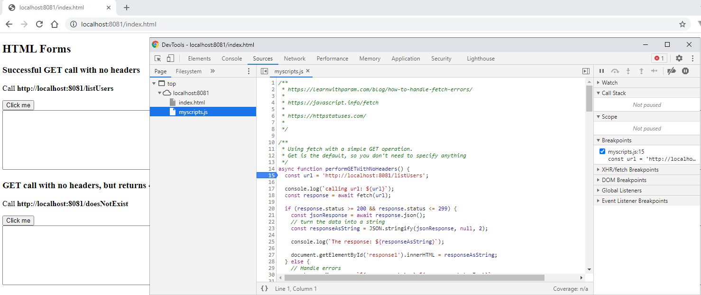

# Fetch API Demo Application

This is a very basic front-end and back-end application meant to showcase how to use the `fetch` method in javascript.

## Pre-requisites
- Install git 
- Install node.js

## Setup

```sh
npm install
```

## Start the server

```sh
npm start
```

## Try out different API

Open your browser to <a href="http://localhost:8081/index.html">http://localhost:8081/index.html</a>

Try out different calls; some with deliberate errors and some without.

`index.html` imports the script file `myscripts.js` which contains
the different functions used in `index.html` .

Right-click index.html to open up the developer console, click on Sources tab, select myscripts.js, and put a breakpoint in one of the functions.

Then in the browser, click on the appropriate button to call that function.




### Example JSON for POST methods

 Copy this JSON and paste it into the text area of a POST example. Change the values of the variable values, but not the variable names.

```json
  {
    "name": "user",
    "password": "password1",
    "profession": "teacher"
  }
```

## Stop the server

When you are done, return to the command line where you started the server, and press CTRL C.
